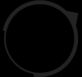

# Melee Positional Miss Trigger for [Triggevent](https://github.com/xpdota/event-trigger/)



The classic positional hit/miss trigger, but now in Triggevent.

To add:

In Triggevent > Plugin Settings > Manage Addons > Add From URL, enter:
```
https://xpdota.github.io/positional-miss-trigger/master/INFO
```